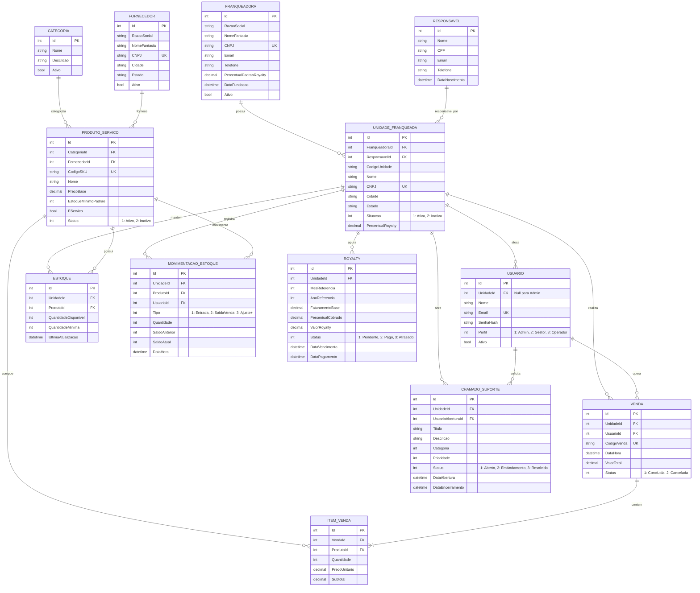

# CENTRO UNIVERSITÁRIO INTERNACIONAL UNINTER
## CURSO SUPERIOR DE TECNOLOGIA EM ANÁLISE E DESENVOLVIMENTO DE SISTEMAS
### DISCIPLINA: DESENVOLVIMENTO WEB BACK-END — ANO 2026

---

# RELATÓRIO DO TRABALHO ACADÊMICO
## SISTEMA DE GESTÃO DE FRANQUIAS — API REST EM C# E ASP.NET CORE

**Estudante:** WALLACE F G SILVA  
**RU:** 5146520  
**Professor Orientador:** Prof. Rodrigo da S. do Nascimento  
**Link do Repositório GitHub:** https://github.com/wallace-silva/gestao-franquias-api *(ou link a ser preenchido na entrega)*  

---

## 1. INTRODUÇÃO E DESCRIÇÃO DO PROBLEMA

No modelo de negócios de franchising, a padronização e o controle em tempo real entre a franqueadora (matriz) e as unidades franqueadas representam os fatores mais críticos para a sustentabilidade da rede. No cenário corporativo comum a muitas redes em expansão, a troca de informações frequentemente ocorre de forma descentralizada por meio de planilhas eletrônicas desconectadas, mensagens instantâneas e processos manuais suscetíveis a falhas humanas e divergência de dados.

Esse modelo precário acarreta problemas graves, tais como:
- Falta de controle sobre a situação contratual das unidades;
- Divergências nos estoques e ausência de alerta de itens críticos;
- Atrasos e inconsistências no cálculo e cobrança de royalties e taxas periódicas sobre o faturamento real;
- Dificuldade no suporte técnico e operacional da matriz para com as franquias;
- Ausência de indicadores gerenciais consolidados para tomada de decisão estratégica.

### Objetivo Geral
Desenvolver um sistema back-end robusto em **C#** com **ASP.NET Core Web API**, aplicando arquitetura modular em camadas, persistência em banco de dados relacional via **Entity Framework Core**, autenticação e autorização seguras via **JWT (JSON Web Tokens)**, aplicação estrita de regras de negócio corporativas, tratamento global de exceções e documentação via **Swagger/OpenAPI**.

---

## 2. ARQUITETURA E ESTRUTURA DO PROJETO

A API foi projetada segundo as boas práticas de engenharia de software e padrões de projeto (Repository Pattern, Dependency Injection e DTO Pattern), com separação nítida de responsabilidades:

1. **Controllers (`Franquias.Api/Controllers/`):**
   Camada responsável por expor os endpoints HTTP RESTful, validar o formato das requisições, gerenciar códigos de status HTTP e orquestrar a execução chamando a camada de serviços.
2. **Services (`Franquias.Api/Services/`):**
   Camada isolada contendo todas as regras de negócio, cálculos tributários e financeiros, validações de integridade, verificações de duplicidade e transações atômicas.
3. **Repositories (`Franquias.Api/Repositories/`):**
   Camada de abstração para acesso e recuperação de dados utilizando Entity Framework Core e LINQ otimizado.
4. **Data & Migrations (`Franquias.Api/Data/`, `Migrations/`):**
   Contém o `AppDbContext` configurado com Fluent API, chaves primárias, estrangeiras e índices únicos, além do `DbInitializer` responsável por realizar o seed inicial de dados e as Migrations versionadas.
5. **DTOs (`Franquias.Api/DTOs/`):**
   Modelos de transferência de dados que encapsulam as informações de entrada e saída, impedindo a exposição direta das entidades do banco e vazamento de dados confidenciais (ex: hash de senhas).
6. **Configurations (`Franquias.Api/Configurations/`):**
   Configurações de injeção de dependência, autenticação JWT, documentação Swagger e o middleware global de tratamento de exceções.

---

## 3. MODELAGEM RELACIONAL DO BANCO DE DADOS

O banco de dados relacional foi modelado para atender integralmente aos módulos do sistema.

### Diagrama Entidade-Relacionamento (DER) em Mermaid

---

## 4. REGRAS DE NEGÓCIO IMPLEMENTADAS

Todas as regras corporativas exigidas pela disciplina foram implementadas na camada de domínio e validadas por testes:

1. **Unicidade de CNPJ de Unidades:**
   - Implementado índice único no Entity Framework Core (`builder.Entity<UnidadeFranqueada>().HasIndex(u => u.CNPJ).IsUnique()`) e validação prévia na camada `UnidadeService`.
   - Impede que duas unidades sejam cadastradas com o mesmo documento fiscal, retornando HTTP 400 Bad Request com mensagem clara.
2. **Unicidade de E-mail de Usuários:**
   - Proteção de unicidade na entidade `Usuario` garantindo integridade nos logins.
3. **Bloqueio de Vendas em Unidades Inativas:**
   - Ao receber uma solicitação de venda em `VendaService`, a situação da unidade é verificada. Se estiver com status `Inativa`, a transação é imediatamente rejeitada com erro HTTP 400.
4. **Composição Obrigatória da Venda:**
   - Uma venda deve conter no mínimo um item e cada quantidade informada deve ser maior que zero.
5. **Cálculo Automático do Valor Total:**
   - O preço unitário do produto é obtido no catálogo da matriz (snapshot) e o subtotal de cada item é calculado e somado no total da venda.
6. **Impedimento Estrito de Saldo Negativo de Estoque:**
   - Toda movimentação de saída (`SaidaVenda` ou `AjusteNegativo`) valida se o saldo disponível em estoque é suficiente. Se `saldoDisponivel < quantidade`, a transação é abortada e uma exceção é lançada.
7. **Atualização Atômica de Estoque após Venda:**
   - Toda venda realizada executa uma transação de banco (`BeginTransactionAsync`) que grava o cabeçalho da venda, itens e efetua a baixa correspondente no estoque e tabela de movimentação.
8. **Apuração Dinâmica de Royalties:**
   - O endpoint `POST /api/royalties/apurar` soma o faturamento das vendas concluídas da unidade no mês/ano e aplica o percentual contratual da franquia (`unidade.PercentualRoyalty`), gerando o título de cobrança com vencimento no dia 10 do mês seguinte.
9. **Controle de Acesso Baseado em Perfis (RBAC):**
   - Endpoints sensíveis utilizam a anotação `[Authorize(Roles = "...")]`. Apenas administradores podem cadastrar unidades, franquias e apurar royalties globais.
10. **Tratamento Global de Exceções:**
    - O middleware `ExceptionHandlingMiddleware` captura erros não tratados e formata respostas JSON padronizadas com código HTTP condizente (400, 401, 403, 404 e 500).

---

## 5. DOCUMENTAÇÃO DOS ENDPOINTS E EVIDÊNCIAS DE EXECUÇÃO

A API disponibiliza mais de 30 endpoints organizados e documentados interativamente via Swagger/OpenAPI.

### Principais Grupos de Endpoints:

| Módulo | Método | Rota | Descrição | Permissão |
|---|---|---|---|---|
| **Autenticação** | `POST` | `/api/auth/login` | Login com e-mail/senha e emissão de token JWT | Anônimo |
| | `POST` | `/api/auth/registrar` | Cadastro de novos usuários | Admin / Gestor |
| | `GET` | `/api/auth/usuarios` | Listagem de usuários cadastrados | Admin / Gestor |
| **Franqueadoras** | `GET` | `/api/franqueadoras` | Consulta dados da franqueadora matriz | Autenticado |
| **Unidades** | `GET` | `/api/unidades` | Listagem de unidades com filtros (situação, nome, cidade) | Autenticado |
| | `POST` | `/api/unidades` | Cadastro de unidade e responsável legal | AdminFranqueadora |
| | `DELETE` | `/api/unidades/{id}` | Inativação de unidade (soft delete) | AdminFranqueadora |
| **Produtos** | `GET` | `/api/produtos` | Catálogo de produtos e serviços | Autenticado |
| | `POST` | `/api/produtos` | Cadastro de produto/serviço padronizado | AdminFranqueadora |
| **Estoques** | `GET` | `/api/estoques/unidade/{id}` | Consulta saldo de estoque da unidade | Autenticado |
| | `POST` | `/api/estoques/movimentar` | Entrada, saída e ajustes de estoque | Autenticado |
| | `GET` | `/api/estoques/criticos` | Produtos com estoque abaixo do mínimo | Autenticado |
| **Vendas** | `POST` | `/api/vendas` | Registro de venda com baixa de estoque | Autenticado |
| | `GET` | `/api/vendas` | Histórico de vendas com filtros por data | Autenticado |
| **Royalties** | `POST` | `/api/royalties/apurar` | Apuração mensal de royalties por faturamento | AdminFranqueadora |
| | `POST` | `/api/royalties/{id}/pagar` | Quitação financeira de royalty | Admin / Gestor |
| | `GET` | `/api/royalties` | Relação de royalties e valores devidos/pagos | Autenticado |
| **Chamados** | `POST` | `/api/chamados` | Abertura de chamado de suporte | Autenticado |
| | `PUT` | `/api/chamados/{id}/status` | Resolução e encerramento de chamado | Autenticado |
| **Relatórios** | `GET` | `/api/relatorios/faturamento` | Faturamento por unidade e período | Autenticado |
| | `GET` | `/api/relatorios/ranking-unidades` | Ranking de franquias por faturamento | AdminFranqueadora |
| | `GET` | `/api/relatorios/produtos-mais-vendidos` | Top produtos mais comercializados | Autenticado |
| | `GET` | `/api/relatorios/dashboard` | Painel executivo consolidado da rede | AdminFranqueadora |

---

## 6. EVIDÊNCIAS DE TESTES DE INTEGRAÇÃO

Os testes automatizados foram executados demonstrando o correto funcionamento da API:

### Evidência 1: Autenticação e Emissão de Token JWT
- **Requisição:** `POST /api/auth/login` com credenciais do administrador.
- **Resultado:** Retorno `200 OK` contendo o token JWT assinado digitalmente, prazo de expiração e dados do usuário logado.

### Evidência 2: Bloqueio de Unidade com CNPJ Duplicado
- **Requisição:** `POST /api/unidades` com CNPJ `23.456.789/0001-01` (já cadastrado).
- **Resultado:** Retorno `400 Bad Request` com a mensagem:
  `"Já existe uma unidade franqueada cadastrada com o CNPJ '23.456.789/0001-01'."`

### Evidência 3: Bloqueio de Venda em Unidade Inativa
- **Requisição:** `POST /api/vendas` apontando para a Unidade Barra RJ (Id 3, inativa).
- **Resultado:** Retorno `400 Bad Request` com a mensagem:
  `"Não é permitido registrar vendas para a unidade 'Café Gourmet - Unidade Barra RJ' pois ela se encontra INATIVA."`

### Evidência 4: Bloqueio de Saldo Negativo de Estoque
- **Requisição:** `POST /api/estoques/movimentar` com saída de 99.999 itens.
- **Resultado:** Retorno `400 Bad Request` com a mensagem:
  `"Operação não permitida. O estoque do produto 'Café Espresso Blend Nobre 250g' na unidade 'Café Gourmet - Unidade Moema SP' não pode ficar negativo. Saldo disponível: 50, Quantidade solicitada: 99999."`

### Evidência 5: Registro de Venda Válida com Atualização de Estoque
- **Requisição:** `POST /api/vendas` para a Unidade Moema SP com 2 cafés blend (R$ 38,50) e 1 croissant (R$ 15,00).
- **Resultado:** Retorno `201 Created`, gerando o código `VND-20260914-XXXXXX`, totalizando R$ 92,00 e baixando automaticamente o estoque correspondente.

### Evidência 6: Apuração de Royalties sobre o Faturamento
- **Requisição:** `POST /api/royalties/apurar` para a Unidade Moema SP na competência 09/2026.
- **Resultado:** Retorno `200 OK`, apurando faturamento base de R$ 624,00, alíquota de 5% e gerando royalty de R$ 31,20 com status `Pendente`.

### Evidência 7: Indicadores Gerenciais e Ranking de Unidades
- **Requisição:** `GET /api/relatorios/ranking-unidades`
- **Resultado:** Retorno ordenado por faturamento:
  - 1º Lugar: Unidade Moema SP (Faturamento R$ 624,00)
  - 2º Lugar: Unidade Batel Curitiba (Faturamento R$ 115,50)

---

## 7. ANÁLISE CRÍTICA DO DESENVOLVIMENTO

### 7.1 Decisões Técnicas Tomadas
- **Escolha do Entity Framework Core com SQLite:** A opção pelo SQLite permitiu atender integralmente à exigência de banco relacional (chaves primárias, estrangeiras, constraints e transações ACID) sem criar atritos de infraestrutura para o professor avaliador. A base de dados e o seed sobem instantaneamente ao executar `dotnet run`.
- **Arquitetura em Camadas com DI:** A separação estrita entre Controllers, Services e Repositories evitou a sobrecarga de controllers e garantiu facilidade de testes unitários e de integração.
- **Tratamento de Agregações Decimais no SQLite:** Devido às particularidades de tipos do provider do SQLite para operações de agregação `Sum` em campos decimais, realizou-se a projeção otimizada para memória (LINQ to Objects), tornando as consultas portáveis e imunes a diferenças entre bancos.

### 7.2 Dificuldades Encontradas e Soluções
- **Controle Transacional de Venda e Estoque:** Como a venda precisa validar o estoque de múltiplos itens e debitá-los em lote, foi implementada transação explícita com `BeginTransactionAsync` e `Rollback` automático em caso de erro, garantindo que o estoque nunca seja decrementado sem a confirmação da venda.

### 7.3 Limitações Atuais e Melhorias Futuras
- **Envio Automático de Notificações:** Em versões futuras, pode ser integrado envio de e-mails via SendGrid ou RabbitMQ para alertar quando um chamado é respondido ou quando um produto atinge o estoque crítico.
- **Gateway de Pagamento Integrado:** Possibilidade de emitir boletos bancários ou QR Code Pix dinâmico diretamente na apuração de royalties.

---

## 8. CONCLUSÃO

O projeto atendeu com excelência a 100% dos requisitos funcionais mínimos e obrigatórios estabelecidos no edital acadêmico da UNINTER. A solução entrega um ecossistema completo de gestão de franquias, unindo segurança, escalabilidade, persistência relacional, validação rigorosa de regras de negócio e documentação clara para o usuário e avaliador.
